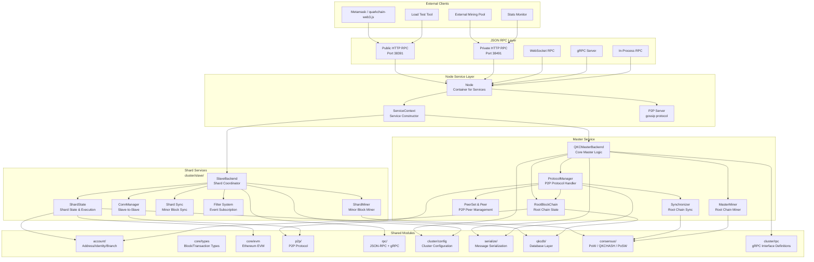
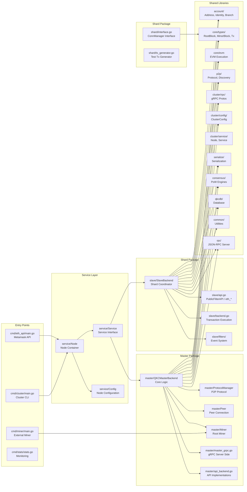
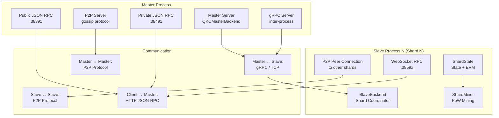

# GoQuarkChain 架构图

## 项目概览

GoQuarkChain 是 QuarkChain 分片区块链协议的 Go 语言实现。QuarkChain 采用两层架构：
- **Root Chain（根链层）**: 保护网络安全、协调跨分片交易
- **Shard Layer（分片层）**: 多个分片链并行处理交易，容量随分片数量线性扩展

## 顶层架构

## 模块依赖图

## 数据流图

```mermaid
graph TB
    subgraph "Transaction Flow"
        T1[Client sends<br/>Raw Transaction]
        T2[Public HTTP RPC<br/>eth_sendRawTransaction]
        T3[QKCMasterBackend<br/>AddTransaction]
        T4[Resolve shard by<br/>FromChainID → FullShardId]
        T5[SlaveConn<br/>AddTransaction via gRPC]
        T6[ShardState<br/>add_tx → EVM execution]
        T7[Broadcast to P2P peers]
    end

    subgraph "Mining Flow"
        M1[B miner calls<br/>getWork]
        M2[QKCMasterBackend<br/>GetWork → dispatch to root/miner]
        M3[RootMiner creates<br/>RootBlock candidate]
        M4[Slave queries unconfirmed<br/>minor block headers]
        M5[RootBlock assembled with<br/>minor block headers]
        M6[Miner finds valid nonce]
        M7[SubmitWork → add_root_block]
        M8[RootBlock added to<br/>RootBlockChain]
        M9[Broadcast to peers & slaves]
    end

    subgraph "Block Production Flow"
        B1[ShardMiner calls<br/>createBlockToMine]
        B2[ShardState assembles<br/>MinorBlock from tx pool]
        B3[Miner finds valid PoW]
        B4[handle_new_block → validate]
        B5[add_block → execute txs]
        B6[Broadcast to shard peers]
        B7[send_minor_block_header_to_master]
        B8[broadcast_xshard_tx_list<br/>for cross-shard txs]
    end

    T1 --> T2 --> T3 --> T4 --> T5 --> T6 --> T7
    M1 --> M2 --> M3 --> M4 --> M5 --> M6 --> M7 --> M8 --> M9
    B1 --> B2 --> B3 --> B4 --> B5 --> B6 --> B7 --> B8
```

## 进程模型

## 关键组件说明

| 组件 | 包路径 | 职责 |
|------|--------|------|
| **Node** | `cluster/service/node.go` | 节点容器，管理所有服务的生命周期（类似 go-ethereum 的 Node） |
| **Service** | `cluster/service/service.go` | 服务接口，定义 Protocols/ APIs/ Start/Stop |
| **QKCMasterBackend** | `cluster/master/handle.go` | 主节点核心逻辑：交易分发、块同步、RPC 实现 |
| **ProtocolManager** | `cluster/master/handle.go` | P2P 协议管理器，处理 peer 连接、消息分发、根链同步 |
| **MasterMiner** | `cluster/master/miner.go` | 根链矿工，创建和挖掘 RootBlock |
| **SlaveBackend** | `cluster/slave/api.go` | 分片节点协调器，处理所有 shard RPC 请求 |
| **PublicFilterAPI** | `cluster/slave/api.go` | 提供 eth_* JSON-RPC 接口（兼容以太坊） |
| **ShardState** | `cluster/slave/backend.go` | 分片状态管理、交易执行、块构建 |
| **ShardMiner** | `cluster/slave/miner.go` | 分片矿工，挖掘 MinorBlock |
| **RootBlockChain** | `core/` | 根链状态和持久化 |
| **ConnManager** | `cluster/shard/interface.go` | 分片间通信管理器（跨分片交易广播等） |
