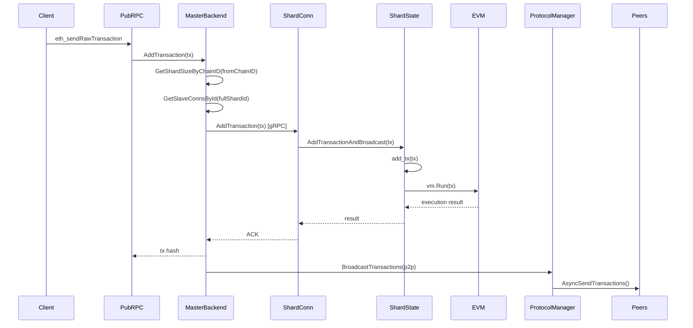
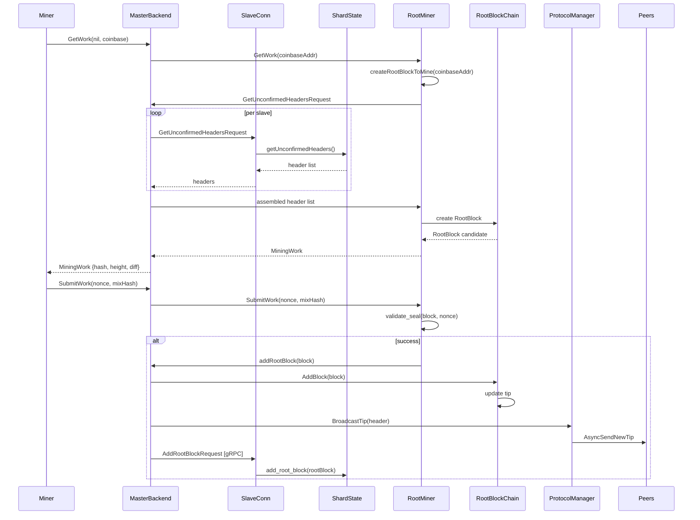
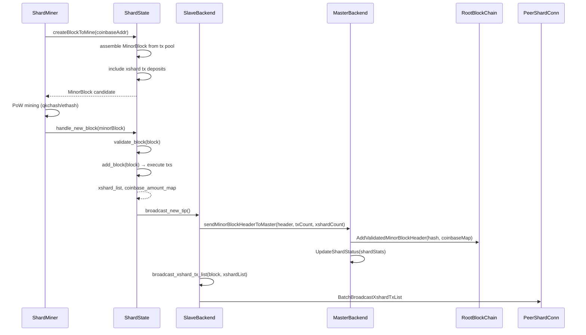
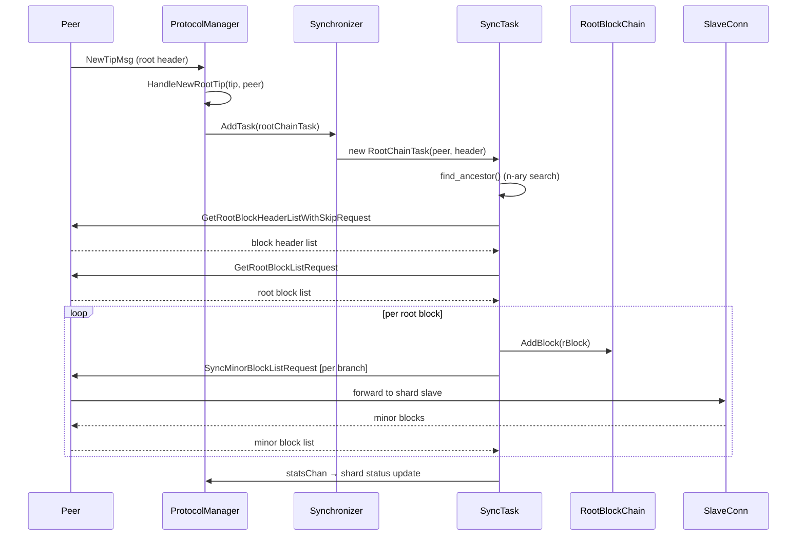
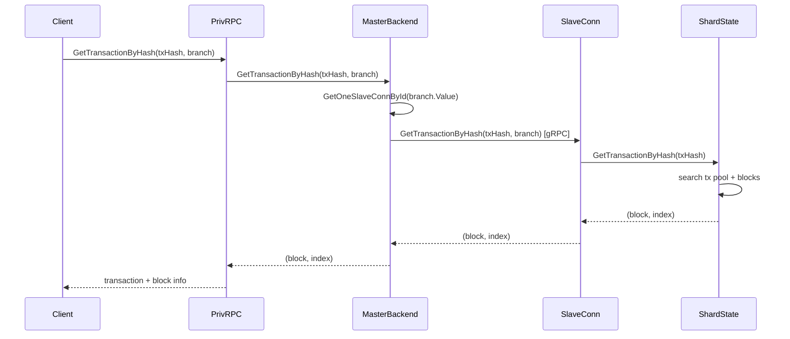
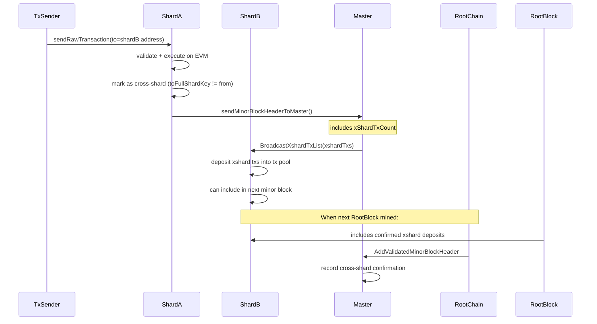
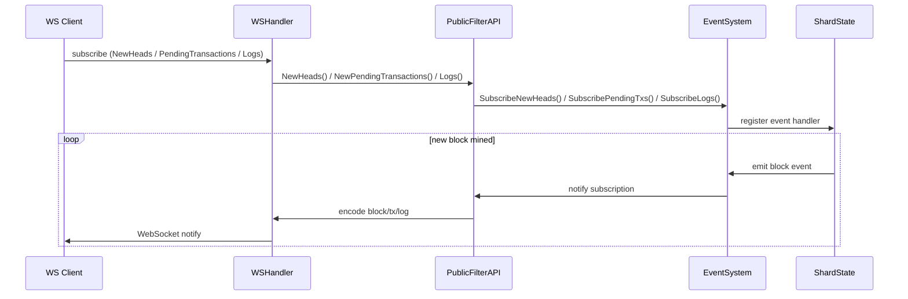
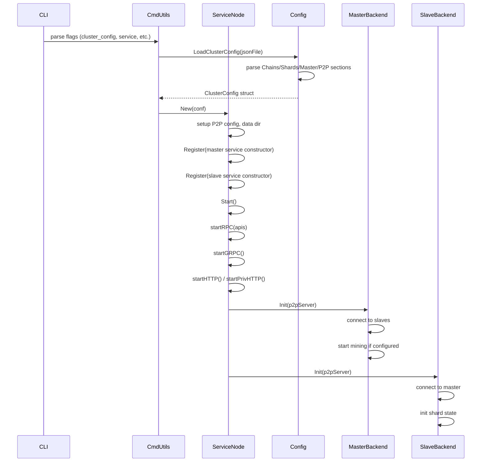

# GoQuarkChain 调用图

## 1. 客户端发送交易流程

**关键函数调用链:**
1. `cmd/eth_api/main.go` → HTTP handler
2. `cluster/master/api_backend.go` → `AddTransaction(tx)`
3. `cluster/master/api_backend.go` → `GetSlaveConnsById(fullShardId)`
4. `cluster/rpc/grpc_client.go` → `AddTransaction(req)`
5. `cluster/slave/backend.go` → `AddTransactionAndBroadcast(tx)`
6. `cluster/slave/backend.go` → `state.addTx(tx)`
7. `core/evm/evm.go` → `EVM.Execute()`

## 2. RootBlock 挖矿流程

**关键函数调用链:**
1. `cluster/master/api_backend.go` → `GetWork(nil, addr)`
2. `cluster/master/miner.go` → `createRootBlockToMine(coinbaseAddr)`
3. `cluster/master/handle.go` → `getUnconfirmedHeaders()` (fan-out to all slaves)
4. `cluster/master/miner.go` → `insertMinedBlock(block)` → `AddRootBlock`
5. `cluster/master/handle.go` → `addRootBlock(rBlock)`
6. `core/root_chain.go` → `AddBlock(rBlock)`

## 3. MinorBlock 分片挖矿流程

**关键函数调用链:**
1. `cluster/slave/miner.go` → `createBlockToMine()`
2. `cluster/slave/backend.go` → `state.CreateBlockToMine()`
3. `cluster/slave/api.go` → `HandleNewBlock(block)`
4. `cluster/slave/backend.go` → `state.AddBlock(block)`
5. `cluster/rpc/grpc_client.go` → `SendMinorBlockHeaderToMaster(req)`
6. `cluster/master/master_grpc.go` → `AddMinorBlockHeader(ctx, req)`
7. `cluster/master/handle.go` → `rootBlockChain.AddValidatedMinorBlockHeader()`

## 4. P2P 同步流程 (Root Chain)

**关键函数调用链:**
1. `cluster/master/handle.go` → `handleMsg()` → `HandleNewRootTip()`
2. `cluster/master/sync.go` → `Synchronizer.AddTask()`
3. `cluster/master/sync.go` → `SyncTask.sync()`
4. `cluster/master/sync.go` → `SyncTask.find_ancestor()`
5. `p2p/` → GetRootBlockHeaderList RPC
6. `cluster/master/sync.go` → `SyncTask.__addBlock()`

## 5. 查询交易详情

## 6. 跨分片交易 (Cross-Shard Transaction)

## 7. WebSocket 订阅事件

## 8. 配置加载与节点启动

## gRPC 接口定义 (cluster/rpc/rpc.proto)

主要的 gRPC RPC 方法:

| 方向 | 方法 | 说明 |
|------|------|------|
| Master←Slave | AddMinorBlockHeader | Slave 提交已验证的 minor block header |
| Master←Slave | AddMinorBlockHeaderList | 批量提交 minor block headers |
| Master→Slave | AddTransaction | 分发交易到指定分片 |
| Master→Slave | GetMinorBlockByHash/Height | 查询分区块 |
| Master→Slave | GetTransactionByHash | 查询交易 |
| Master→Slave | GetWork / SubmitWork | 挖矿工作分配 |
| Master→Slave | SyncMinorBlockList | 同步分区块列表 |
| Master→Slave | ExecuteTransaction | 模拟交易执行 |
| Peer→Peer | NewTipMsg | P2P 新区通告 |
| Peer→Peer | NewTransactionListMsg | 新交易广播 |
| Peer→Peer | NewBlockMinorMsg | 新区块广播 |
