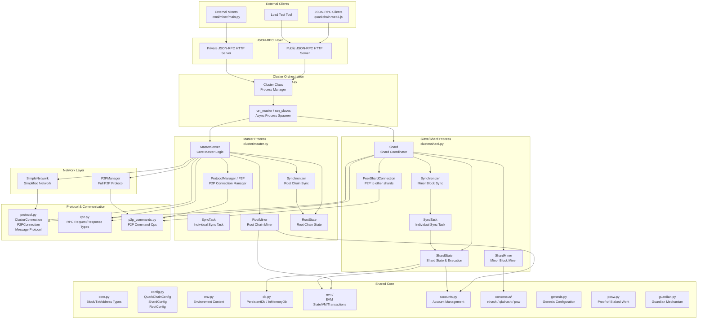
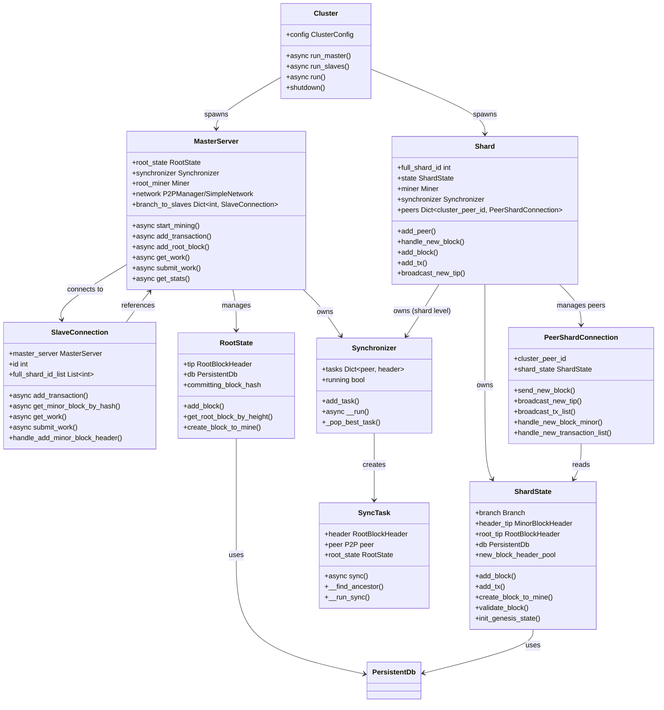
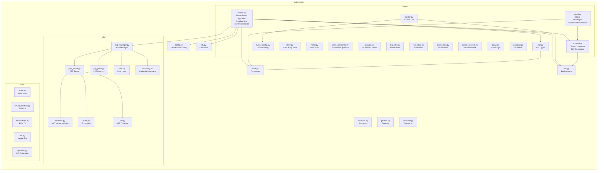
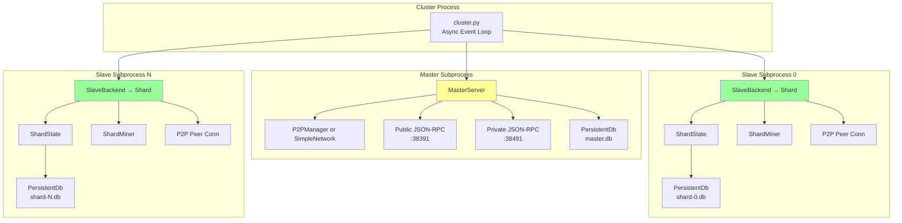

# PyQuarkChain 架构图

## 项目概览

PyQuarkChain 是 QuarkChain 分片区块链协议的 Python 参考实现。它是 QuarkChain 协议设计的原始参考，
GitHub Wiki 上的协议设计文档均基于 Python 实现。GoQuarkChain 是其性能优化版本。

## 顶层架构

## 核心类关系图

## 模块文件组织

## 进程模型

## 关键组件说明

| 组件 | 文件 | 职责 |
|------|------|------|
| **Cluster** | `cluster/cluster.py` | 进程编排器，启动 master 和所有 slave 子进程 |
| **MasterServer** | `cluster/master.py` | 主节点核心：管理 slave 连接、根链同步、交易分发、挖矿 |
| **SlaveConnection** | `cluster/master.py` | master 到每个 slave 的 RPC 连接，转发所有 RPC 请求 |
| **Shard** | `cluster/shard.py` | 分片协调器，管理分片状态、矿工、P2P peer 连接、同步 |
| **ShardState** | `cluster/shard_state.py` | 分片状态：交易池、块执行、状态树、genesis 初始化 |
| **RootState** | `cluster/root_state.py` | 根链状态：根块管理、跨分片交易确认 |
| **P2PManager** | `p2p/p2p_manager.py` | 完整 P2P 网络协议管理，含 discovery、peer 管理 |
| **SimpleNetwork** | `cluster/simple_network.py` | 简化网络实现（不含 P2P discovery） |
| **Miner** | `cluster/miner.py` | 通用矿工类，支持 root 和 shard 链挖矿 |
| **Synchronizer** | `cluster/master.py` | 根链同步器，从 peer 下载新根块 |
| **SyncTask** | `cluster/master.py` | 单次同步任务，含 ancestor 查找和块下载 |
