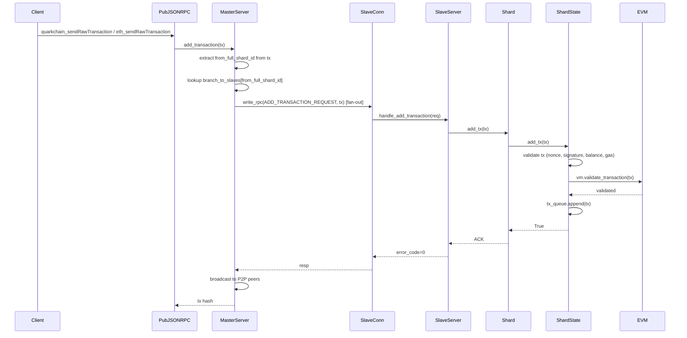
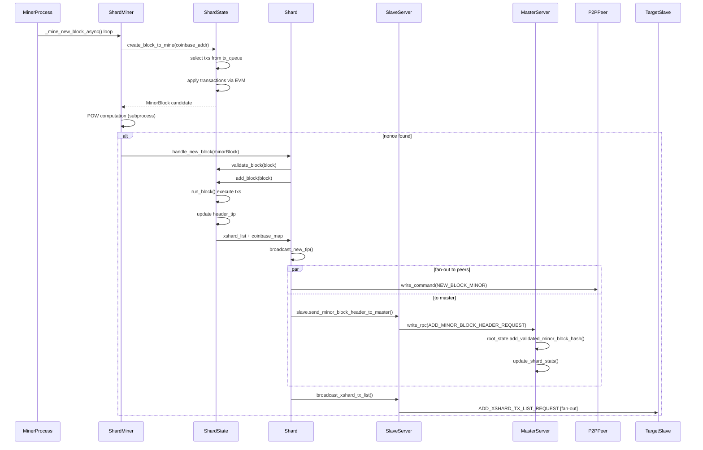
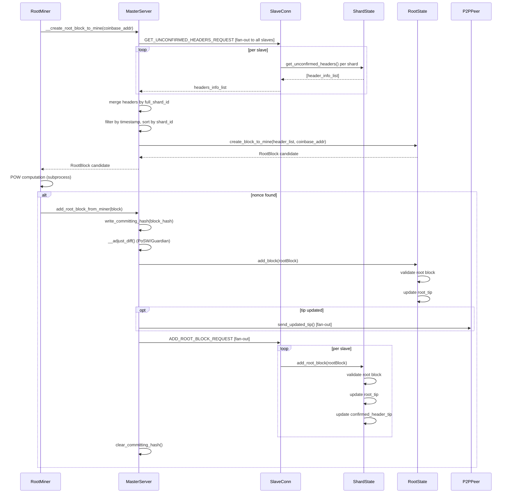
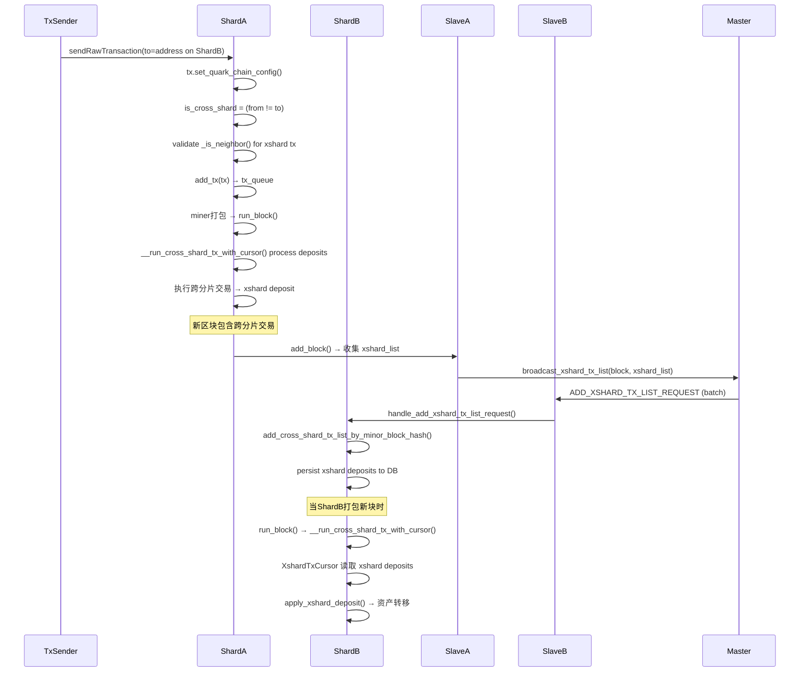
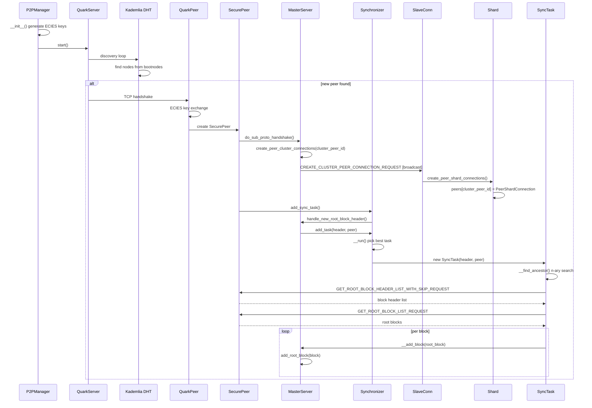
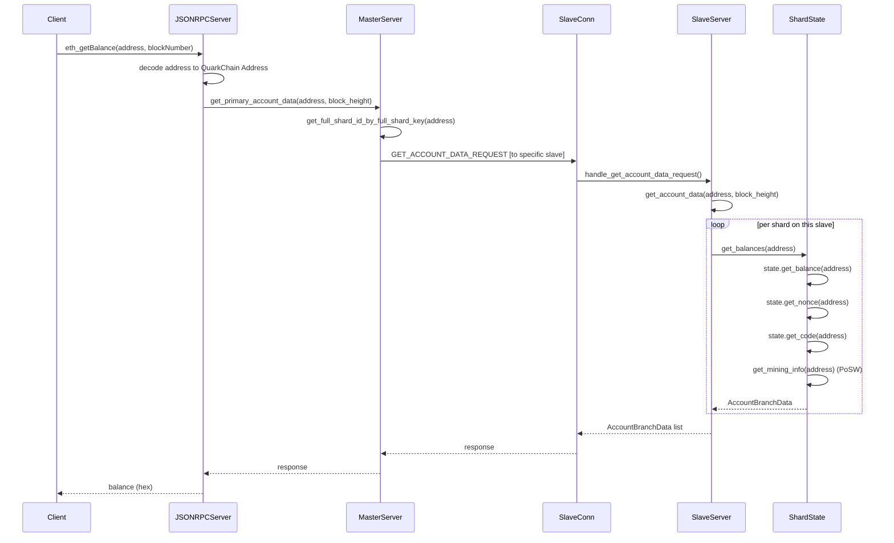
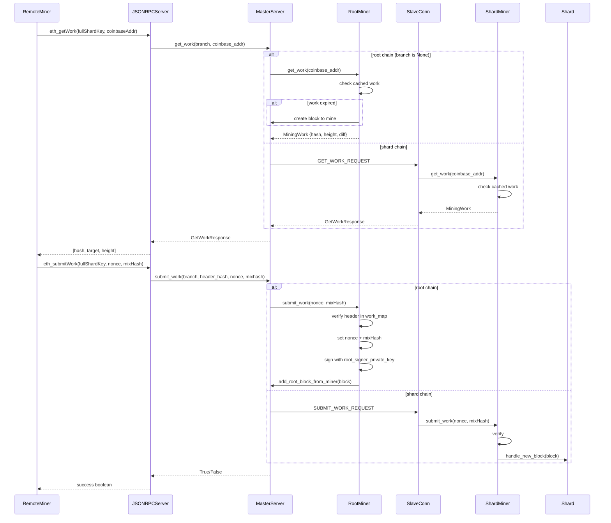
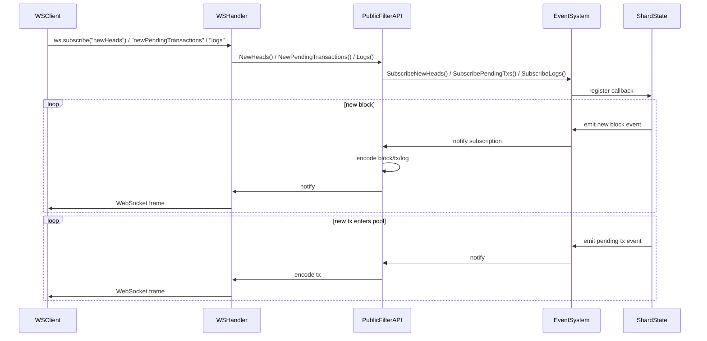

# PyQuarkChain 调用图

## 1. 客户端发送交易 → 分片打包流程

**关键函数调用链:**
1. `cluster/jsonrpc.py` → `handle_quarkchain_sendRawTransaction()` / `handle_eth_sendRawTransaction()`
2. `cluster/master.py` → `MasterServer.add_transaction(tx)` (L1225)
3. `cluster/master.py` → `SlaveConnection.write_rpc(ADD_TRANSACTION_REQUEST)` (L524)
4. `cluster/slave.py` → `SlaveServer.handle_add_transaction()` (L308)
5. `cluster/slave.py` → `SlaveServer.add_tx(tx)` (L1202)
6. `cluster/shard.py` → `Shard.add_tx(tx)` (L915)
7. `cluster/shard_state.py` → `ShardState.add_tx(tx)` (L544)

## 2. 分片挖矿流程

**关键函数调用链:**
1. `cluster/miner.py` → `Miner._mine_new_block_async()` (L176)
2. `cluster/miner.py` → `create_block_async_func(coinbase_addr)` → `ShardState.create_block_to_mine()`
3. `cluster/shard.py` → `Shard.handle_new_block(block)` (L646)
4. `cluster/shard_state.py` → `ShardState.validate_block(block)`
5. `cluster/shard_state.py` → `ShardState.add_block(block)` (L893)
6. `cluster/shard.py` → `Shard.broadcast_new_tip()`
7. `cluster/slave.py` → `SlaveServer.send_minor_block_header_to_master()`

## 3. RootBlock 挖矿流程

**关键函数调用链:**
1. `cluster/master.py` → `MasterServer.__create_root_block_to_mine()` (L1107)
2. `cluster/master.py` → `SlaveConnection.write_rpc(GET_UNCONFIRMED_HEADERS_REQUEST)`
3. `cluster/master.py` → `RootState.create_block_to_mine(header_list, address)`
4. `cluster/miner.py` → `Miner._mine_new_block_async()` → `add_block_async_func(block)`
5. `cluster/master.py` → `MasterServer.add_root_block(block)` (L1276)
6. `cluster/master.py` → `RootState.add_block(rootBlock)`
7. `cluster/master.py` → `MasterServer.broadcast_rpc(ADD_ROOT_BLOCK_REQUEST)`

## 4. 跨分片交易流程

**关键函数调用链:**
1. `cluster/shard_state.py` → `ShardState.add_tx(tx)` 检查 cross-shard
2. `cluster/shard.py` → `Shard.add_block(block)` 收集 xshard_list (L743)
3. `cluster/slave.py` → `SlaveServer.broadcast_xshard_tx_list()` (L1088)
4. `cluster/slave.py` → `SlaveConnection.handle_add_xshard_tx_list_request()` (L765)
5. `cluster/shard_state.py` → `ShardState.add_cross_shard_tx_list_by_minor_block_hash()`
6. `cluster/shard_state.py` → `ShardState.__run_cross_shard_tx_with_cursor()`
7. `cluster/evm/messages.py` → `apply_xshard_deposit()`

## 5. P2P 节点发现与同步

**关键函数调用链:**
1. `p2p/p2p_manager.py` → `P2PManager.start()` (L418)
2. `p2p/p2p_server.py` → `QuarkServer.run()` (Trinity discovery)
3. `p2p/peer.py` → `BasePeerPool._handshake_with_peer()`
4. `p2p/p2p_manager.py` → `SecurePeer.do_sub_proto_handshake()` (L146)
5. `p2p/p2p_manager.py` → `SecurePeer.start()` (L218) → `master.create_peer_cluster_connections()`
6. `cluster/master.py` → `MasterServer.handle_new_root_block_header()` (L1273)
7. `cluster/master.py` → `Synchronizer.add_task()` → `SyncTask.sync()`

## 6. JSON-RPC 查询流程（eth_getBalance）

**关键函数调用链:**
1. `cluster/jsonrpc.py` → `handle_eth_getBalance()` (L1122)
2. `cluster/jsonrpc.py` → `encode_address(eth_addr, shard)` → Address
3. `cluster/master.py` → `MasterServer.get_primary_account_data(address)` (L1205)
4. `cluster/master.py` → `SlaveConnection.write_rpc(GET_ACCOUNT_DATA_REQUEST)` (L1183)
5. `cluster/slave.py` → `MasterConnection.handle_get_account_data_request()` (L298)
6. `cluster/slave.py` → `SlaveServer.get_account_data()` (L1255)
7. `cluster/shard_state.py` → `ShardState.get_balances()` / `get_transaction_count()`

## 7. 远程挖矿工作分配流程

**关键函数调用链:**
1. `cluster/jsonrpc.py` → `handle_eth_getWork()` (L1017)
2. `cluster/master.py` → `MasterServer.get_work(branch, recipient)` (L1674)
3. `cluster/miner.py` → `Miner.get_work(coinbase_addr)` (L271)
4. `cluster/jsonrpc.py` → `handle_eth_submitWork()`
5. `cluster/master.py` → `MasterServer.submit_work(branch, ...)` (L1695)
6. `cluster/miner.py` → `Miner.submit_work(nonce, mixHash)` (L301)

## 8. WebSocket 订阅事件

## RPC 操作码汇总

### ClusterOp (Master ↔ Slave)

| 操作码 | 方向 | 说明 |
|--------|------|------|
| ADD_TRANSACTION_REQUEST | Master→Slave | 添加交易 |
| ADD_ROOT_BLOCK_REQUEST | Master→Slave | 添加根块 |
| ADD_MINOR_BLOCK_HEADER_REQUEST | Slave→Master | 提交分片区块头 |
| SYNC_MINOR_BLOCK_LIST_REQUEST | Master→Slave | 同步分片块列表 |
| GET_UNCONFIRMED_HEADERS_REQUEST | Master→Slave | 获取未确认区块头 |
| GET_ACCOUNT_DATA_REQUEST | Master→Slave | 查询账户数据 |
| GET_WORK_REQUEST / SUBMIT_WORK_REQUEST | Master↔Slave | 挖矿工作 |
| ADD_XSHARD_TX_LIST_REQUEST | Master→Slave | 添加跨分片交易 |
| CREATE_CLUSTER_PEER_CONNECTION_REQUEST | Master→Slave | 创建 P2P 连接 |
| MINE_REQUEST | Master→Slave | 挖矿控制 |
| GET_NEXT_BLOCK_TO_MINE_REQUEST | Master→Slave | 获取待挖块 |

### CommandOp (P2P 分片间通信)

| 操作码 | 类型 | 说明 |
|--------|------|------|
| NEW_BLOCK_MINOR | Command (单向) | 新区块广播 |
| NEW_MINOR_BLOCK_HEADER_LIST | Command (单向) | 新区块头广播 |
| NEW_TRANSACTION_LIST | Command (单向) | 新交易广播 |
| GET_MINOR_BLOCK_HEADER_LIST_REQUEST | RPC | 查询区块头 |
| GET_MINOR_BLOCK_HEADER_LIST_WITH_SKIP_REQUEST | RPC | 跳读查询 |
| GET_MINOR_BLOCK_LIST_REQUEST | RPC | 查询区块列表 |
